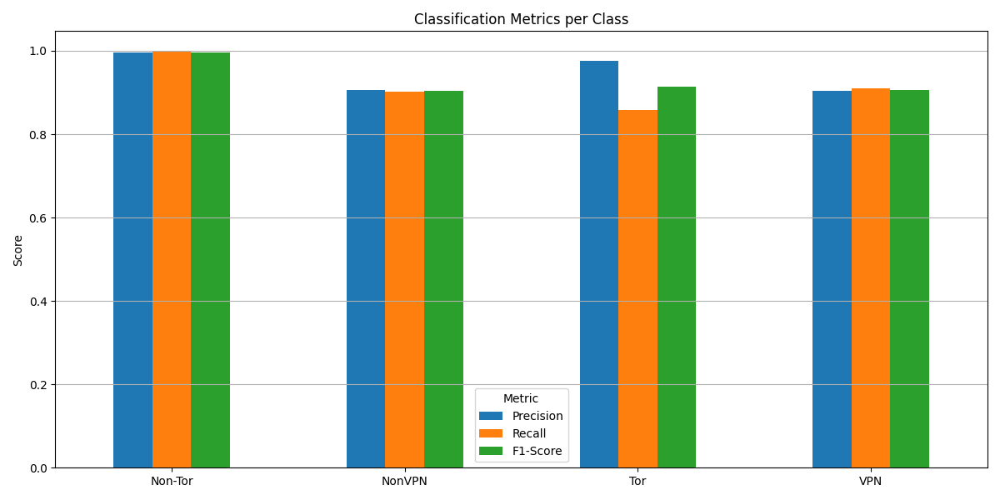

# LSTM for Network Intrusion Detection

This project uses a Long Short-Term Memory (LSTM) neural network to classify network traffic into four categories: Non-Tor, NonVPN, Tor, and VPN. The model is built with Python using TensorFlow/Keras and achieves a high level of accuracy in identifying different types of network flows.

## 🎯 Goal

The primary goal is to build an effective intrusion detection system that can distinguish between benign and anonymized (Tor, VPN) network traffic based on flow characteristics.

##  workflow-chart How It Works

The entire process is contained within the `Intrusion_detection_LSTM.ipynb` Jupyter Notebook and follows these key steps:

1.  **Data Loading and Cleaning:**
    * The model loads the `darknet.csv` dataset.
    * Irrelevant columns (like `Flow ID`, `Src IP`) are dropped.
    * The data is cleaned by handling infinite values and dropping rows with missing data.

2.  **Preprocessing and Feature Scaling:**
    * Categorical labels (`Label` column) are converted into numerical format using `LabelEncoder`.
    * All numerical features are standardized using `StandardScaler`. This is a crucial step that ensures all features contribute equally to the model's performance.
    * The target labels are one-hot encoded to prepare them for multi-class classification.

3.  **Model Architecture:**
    * A `Sequential` model is built using TensorFlow/Keras.
    * The core of the model is a single **LSTM layer** with 50 units. Although the data is tabular, each row is treated as a sequence with a single timestep.
    * The final output layer is a `Dense` layer with `softmax` activation, which outputs the probability for each of the four traffic classes.

4.  **Training and Evaluation:**
    * The model is compiled with the `adam` optimizer and `categorical_crossentropy` loss function.
    * **Early Stopping** is used during training to prevent overfitting and save the best version of the model.
    * The model is trained on 80% of the data and evaluated on the remaining 20% (the test set).

## 📊 Results

The model performs exceptionally well on the test data.

* **Final Test Accuracy:** **96.59%**

The script automatically generates and saves the following plots to visualize the model's performance:

1.  **Training & Validation Accuracy/Loss:** Shows the model's learning progress over epochs.
    

2.  **Confusion Matrix:** A heatmap that visualizes where the model made correct and incorrect predictions for each class.
    

3.  **Classification Metrics:** A bar chart showing the precision, recall, and F1-score for each traffic type.
    

## 🚀 How to Run

1.  **Clone the repository:**
    ```bash
    git clone [https://your-repository-url.git](https://your-repository-url.git)
    cd your-repository-folder
    ```
2.  **Install dependencies:**
    ```bash
    pip install -r requirements.txt
    ```
3.  **Place the dataset:**
    * Ensure the `darknet.csv` file is located in the `/content/sample_data/` directory or update the path in the notebook.
4.  **Run the Jupyter Notebook:**
    * Open and run the `Intrusion_detection_LSTM.ipynb` notebook in a Jupyter environment.

## 🛠️ Dependencies

* Python 3.x
* pandas
* numpy
* scikit-learn
* tensorflow / keras
* matplotlib
* seaborn
